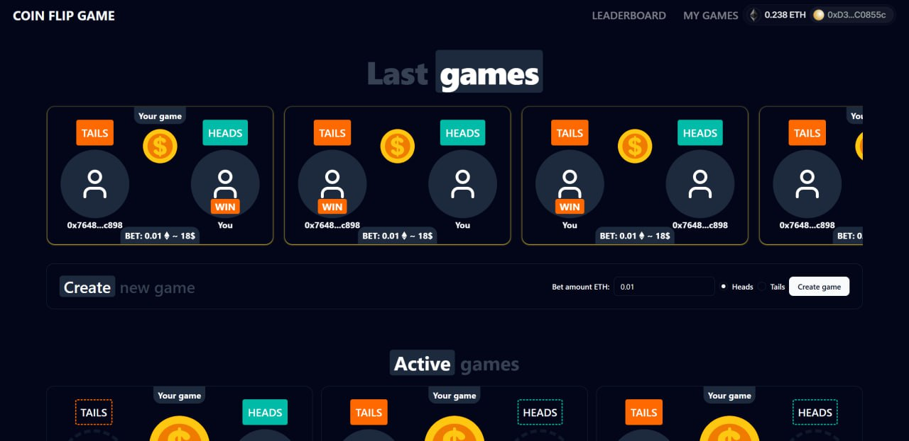

# 🪙 CoinFlip Game - On-Chain Heads or Tails



A decentralized heads-or-tails game where players can compete against each other with cryptocurrency bets on the Ethereum blockchain (Sepolia Testnet).

## 🌟 Features

- 🏦 Real-money betting with cryptocurrency
- 🔒 Fully transparent on-chain gameplay
- 🤝 Player-vs-player matches
- ⚡ Fast resolution with off-chain computation
- 📜 EIP-712 signed results for security

## 🚀 Live Demo

Play now at: [https://coinflip-game-vert.vercel.app/](https://coinflip-game-vert.vercel.app/)  
_(Currently only supports Sepolia Testnet)_

## 📜 Smart Contract

The game logic is powered by an Ethereum smart contract:  
[View Contract Code](https://gist.github.com/grinmorg/e71cb69ebab6cfac07820008d9c0cb4f)

## ⚙️ Backend System

The resolution backend handles off-chain computation and on-chain result submission:  
[Backend Repository](https://github.com/grinmorg/coinflip-game-resolve-backend)

## 🛠️ How It Works

1. **Player A** creates a game with a bet amount
2. **Player B** joins the game with matching bet
3. Both players submit their coin flip choice (Heads/Tails)
4. Backend computes the random result off-chain
5. Result is signed and submitted to the blockchain via EIP-712
6. Winner receives both bets minus small platform fee

## 💻 Tech Stack

- **Frontend**: React.js (Next.js), Wagmi, Viem, shadcn/ui, Tailwind CSS
- **Smart Contracts**: Solidity
- **Backend**: Node.js (Nest.js), Viem
- **Blockchain**: Ethereum (Sepolia Testnet)
- **Security**: EIP-712 signed messages

## 📦 Installation

To run locally:

```bash
git clone git@github.com:grinmorg/coinflip-game.git
cd coinflip-game
npm install
npm run dev
```
